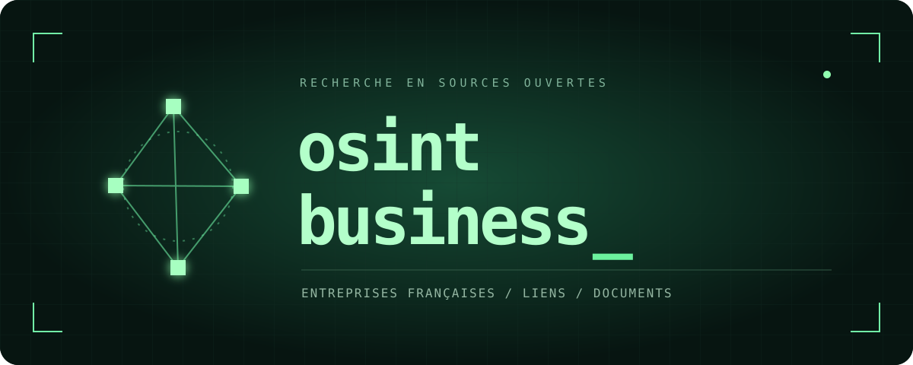

# OSINT Business

**Explorer une entreprise française et comprendre ses liens, avec des sources à chaque étape.**

OSINT Business équipe votre agent IA de 18 outils : recherche d'entreprises, mandats, annonces BODACC, actes et comptes INPI, décisions publiées et graphes de relations. Une méthode accompagne les outils pour distinguer les faits, les homonymes et les pistes à vérifier.

Le projet s'installe sur votre ordinateur dans **Codex ou Claude Code**. Vous choisissez votre agent et utilisez vos propres accès. Aucun modèle IA, compte partagé ou service hébergé n'est fourni.

## Ce que vous pouvez demander

- Identifier une société à partir de son nom ou de son SIREN.
- Explorer les sociétés liées par des mandats professionnels, y compris les SCI.
- Reconstituer une chronologie à partir des annonces et des documents disponibles.
- Comparer des comptes publiés et expliquer les limites des chiffres.
- Produire un rapport et un graphe avec les sources, les incertitudes et les vérifications manquantes.

Un dirigeant commun est un lien de mandat. Une adresse commune est un indice. Aucun des deux ne suffit à prouver un contrôle capitalistique ou une irrégularité.

## Commencer

1. Installez [Node.js, version 24 LTS](https://nodejs.org/) et votre client IA.
2. Téléchargez ce dépôt avec **Code → Download ZIP**, puis décompressez-le. Ouvrez un terminal dans le dossier obtenu.
3. Lancez :

```sh
npm run setup
```

Cette commande installe les dépendances, prépare le programme et génère les configurations adaptées à votre ordinateur. `npm` est fourni avec Node.js. Aucune clé n'est nécessaire pour cette étape.

**Suite : [installation dans Codex ou Claude Code](docs/INSTALLATION.md).** Le guide explique où cliquer, quoi copier et comment vérifier la connexion. Vous pouvez aussi demander à votre agent de lire ce guide et de vous accompagner.

## Les accès, au choix

| Accès | Ce qu'il apporte | Compte nécessaire |
|---|---|---|
| Recherche d'entreprises, BODACC, données AdLC | Identité, mandats exposés, annonces, sanctions publiées | Non |
| INPI | RNE, actes et comptes accessibles | Votre compte et les droits API correspondants |
| Judilibre | Décisions de justice publiées | Votre application PISTE |
| MCP data.gouv.fr | Découverte de jeux et de ressources supplémentaires | Non pour le point d'accès public |
| Origami, OpenLégi | Compléments optionnels | Selon le service, avec votre propre compte |

Les connexions facultatives ne bloquent pas le démarrage. Une fois connectées, l'agent doit les utiliser selon le besoin : Origami pour les ramifications, data.gouv.fr pour compléter les sources, OpenLégi pour les questions juridiques et un lecteur documentaire pour les pièces. La skill précise ces déclencheurs et demande de signaler les accès indisponibles. [Créer et configurer ses accès](docs/ACCES.md).

## Ce qui est fourni

```text
src/                         Les connecteurs et les analyses
scripts/                     Installation, diagnostic et lancement MCP
.agents/skills/osint-business/ La méthode de recherche
AGENTS.md                    Instructions pour Codex
CLAUDE.md                    Entrée pour Claude Code
docs/                        Installation, accès, outils et limites
tests/                       Cas fictifs, sans enquête réelle
```

[Inventaire des outils](docs/OUTILS.md) · [Sécurité et confidentialité](SECURITY.md) · [Exemple de demande](examples/premiere-recherche.md)

## Limites et coût

Le code est libre. L'utilisation de Codex, Claude Code ou d'un autre modèle dépend de votre offre. Les fournisseurs de données peuvent appliquer des quotas ou changer leurs conditions. Le projet ne souscrit aucun abonnement et ne fournit aucune clé.

La couverture des registres varie. Une recherche sans résultat n'établit pas l'absence de sanction ou de contentieux. Les actes doivent être lus avant toute conclusion sur leur contenu. Le routeur réglementaire propose des contrôles ; il ne les réalise pas. L'agent peut commettre des erreurs : vérifiez les pièces décisives avant de diffuser un résultat.

Le serveur tourne localement, mais il interroge les sources en ligne. Les résultats transmis à votre agent peuvent être traités par son fournisseur IA, selon votre configuration.

## Développement

```sh
npm run build
npm test
npm run smoke
```

Les tests utilisent des données fictives et des requêtes simulées. Le test MCP vérifie la découverte des outils et le refus d'un argument invalide, sans lancer d'enquête réelle. Les accès authentifiés INPI et PISTE doivent être vérifiés avec votre compte.

## Licences

Code : [MIT](LICENSE). Documentation, méthode, skill et identité graphique : [CC BY-SA 4.0](LICENSE-DOCS.md), attribution « OSINT Business ». Les données récupérées et les dépendances conservent leurs propres licences. Le projet est indépendant des organismes cités.
